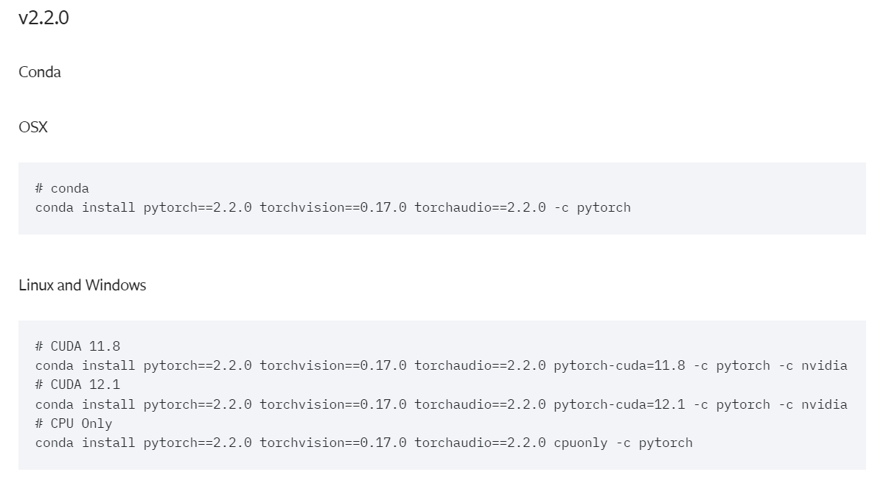

# ChessBot

## Installation

#### 1. Clone the repository:
```bash
git clone https://github.com/chesswondo/ChessBot
```

#### 2. Navigate to projects directory:
```bash
cd ChessBot
```

Note that you will need to set pythonpath at this directory to use the modules.

You will also need to have conda installed on your system.
For more information, see
[conda documentation](https://docs.conda.io/projects/conda/en/latest/user-guide/install/).

#### 3. Create an empty virtual environment with conda:
```bash
conda create --name chess_env python=3.11
```

Python version 3.11 is required to avoid errors with newer version 3.12.

#### 4. Activate the conda environment:
```bash
conda activate chess_env
```

#### 5. _[Install PyTorch 2.2.0](https://pytorch.org/get-started/previous-versions/#v220)_ according to your system.
[](https://pytorch.org/get-started/previous-versions/#v220)

Pytorch version 2.2.0 is also required to avoid errors.

#### 6. Install Openmim (installation tool for MM libraries):
```bash
pip install openmim
```

#### 7. Install **MMCV**:
```bash
mim install mmcv
```

#### 8. Install **MMDetection**:

```bash
mim install mmdet
```

#### 9. Install the rest of the dependencies:
```bash
pip install -r requirements.txt
```

## Usage
To use the program, first navigate to project's directory. Than you can run the next script:
```bash
python demos/demo_game.py --config assets/configs/main.json --monitor 1
```
Here you can change the --monitor flag if you have several monitors and want to use an another one.
